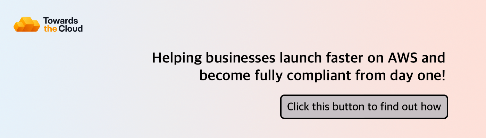

# 

Hi, I’m Danny! AWS Cloud expert and founder of my AWS Consultancy: [Towards the Cloud](https://towardsthecloud.com). specialized in shipping well-architected, resilient, and cost-optimized AWS solutions designed to scale for startups and growing businesses.

> [!TIP]
> Struggling with AWS complexity or stuck on-premise? Let's transform your cloud journey.
>
> [Schedule a call with me](https://towardsthecloud.com/contact) to find out how I can enhance your existing AWS setup or guide your journey from on-premise to the Cloud.
>
> 

☁️ <strong>Discover more about my one-person business: Towards the Cloud</strong>

>
>  
>
> Hi, I'm Danny – AWS expert and founder of [Towards the Cloud](https://towardsthecloud.com). With over a decade of hands-on experience, I specialized myself in deploying well-architected, highly scalable and cost-effective AWS Solutions using Infrastructure as Code (IaC).
>
> #### When you work with me, you're getting a package deal of expertise and personalized service:
>
> - **AWS CDK Proficiency**: I bring deep AWS CDK knowledge to the table, ensuring your infrastructure is not just maintainable and scalable, but also fully automated.
> - **AWS Certified**: [Equipped with 7 AWS Certifications](https://www.credly.com/users/dannysteenman/badges), including DevOps Engineer & Solutions Architect Professional, to ensure best practices across diverse cloud scenarios.
> - **Direct Access**: You work with me, not a team of managers. Expect quick decisions and high-quality work.
> - **Tailored Solutions**: Understanding that no two businesses are alike, I Custom-fit cloud infrastructure for your unique needs.
> - **Cost-Effective**: I'll optimize your AWS spending without cutting corners on performance or security.
> - **Seamless CI/CD**: I'll set up smooth CI/CD processes using GitHub Actions, making changes a breeze through Pull Requests.
>
> *My mission is simple: I'll free you from infrastructure headaches so you can focus on what truly matters – your core business.*
>
> Ready to unlock the full potential of AWS Cloud?
>
> 
> 

## 🥞 My Tech Stack

## 🏗️ My Open Source Projects

| 📂 Projects                                                                                                        | ⭐ Stars                                                                                                                                                                                  | 🍴 Forks                                                                                                                                                                                       | 🚧 Issues                                                                                                                                                                               | 📬 Pull requests                                                                                                                                                                                 |
| ----------------------------------------------------------------------------------------------------------------- | ---------------------------------------------------------------------------------------------------------------------------------------------------------------------------------------- | --------------------------------------------------------------------------------------------------------------------------------------------------------------------------------------------- | -------------------------------------------------------------------------------------------------------------------------------------------------------------------------------------- | ----------------------------------------------------------------------------------------------------------------------------------------------------------------------------------------------- |
| [AWS CloudFormation Starterkit](https://github.com/towardsthecloud/aws-cloudformation-starterkit)                 |                  |                  |                  |                  |
| [AWS CDK Starterkit](https://github.com/towardsthecloud/aws-cdk-starterkit)                                       |                                        |                                        |                                        |                                        |
| [AWS CDK Python Starterkit](https://github.com/towardsthecloud/aws-cdk-python-starterkit)                         |                          |                          |                          |                          |
| [AWS CDK Examples](https://github.com/towardsthecloud/aws-cdk-examples)                                           |                                            |                                            |                                            |                                            |
| [AWS Toolbox](https://github.com/towardsthecloud/aws-toolbox)                                                     |                                                      |                                                      |                                                      |                                                      |
| [VSCode IAM Actions Snippets](https://github.com/towardsthecloud/vscode-iam-actions-snippets)                     |                      |                      |                      |                      |
| [VSCode IAM Service Principal Snippets](https://github.com/towardsthecloud/vscode-iam-service-principal-snippets) |  |  |  |  |
| [VSCode CDK Construct Snippets](https://github.com/towardsthecloud/vscode-cdk-snippets)                           |                                      |                                      |                                      |                                      |
| [VSCode CloudFormation Snippets](https://github.com/towardsthecloud/vscode-cloudformation-snippets)               |                |                |                |                |
| [VSCode SAM Snippets](https://github.com/towardsthecloud/vscode-sam-snippets)                                     |                                      |                                      |                                      |                                      |
| [VSCode CDK Extension Pack](https://github.com/towardsthecloud/vscode-cdk-extension-pack )                        |                          |                          |                          |                          |
| [VSCode CloudFormation Extension Pack](https://github.com/towardsthecloud/vscode-cloudformation-extension-pack )  |    |    |    |    |

## 📙 My Latest Blog Articles

<!-- BLOG-POST-LIST:START -->
- [Autocomplete AWS CDK Constructs in VS Code](https://towardsthecloud.com/blog/autocomplete-aws-cdk-constructs-vscode)
- [10 Best VS Code Extensions for Cloud Engineers](https://towardsthecloud.com/blog/best-vscode-extensions-cloud-engineers)
- [10 Must-Have VS Code extensions for JavaScript developers](https://towardsthecloud.com/blog/best-vscode-extensions-javascript)
- [10 Best VS Code extensions for TypeScript](https://towardsthecloud.com/blog/best-vscode-extensions-typescript)
- [10 Must-Have VS Code extensions for Python developers](https://towardsthecloud.com/blog/best-vscode-extensions-python)
<!-- BLOG-POST-LIST:END -->

▶ [...click here for more blog articles](https://towardsthecloud.com)

## 📈 GitHub Stats

## 👾 Socials

